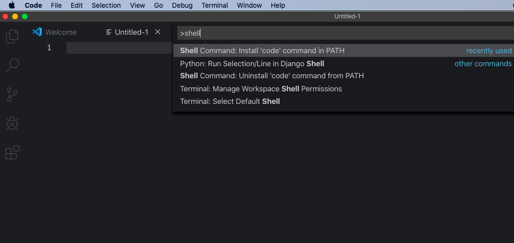

Although there might be many ways to do this like editing the bashrc or zshrc file, but the below method is easy and works like a charm.

1. Open VSCode and press `Command` + `Shift` + `P`
2. Then type `Shell` in command palette
3. You will see `Shell Command: Install Code in Path` 
   Click that and you are done!

> You can now open your terminal and type `code .`

> To open a particular directory in VSCode, go to that directory in terminal and type `code .` or alternatively `code [path of the folder]`
